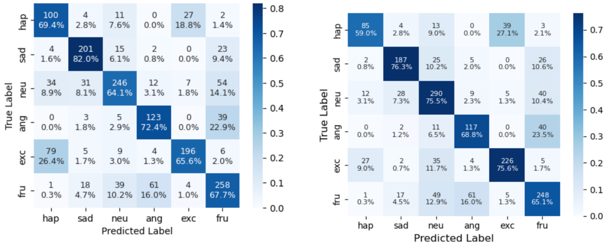

# Contrastive Learning for Multimodal Emotion Recognition

## Overview

This is a course project extending the official ECERC implementation for multimodal emotion recognition in conversation. It studies whether changes to contextual masking, supervised contrastive learning, class-imbalance handling, and training strategy can improve utterance-level emotion classification on IEMOCAP and MELD.

ECERC itself, including its evidence gating, cause encoding, evidence-cause attention, feature gating, and classification architecture, was designed by Tao Zhang and Zhenhua Tan. This repository does not claim authorship of that architecture.

## Upstream Project and Attribution

This project is based on the official implementation of:

> Tao Zhang and Zhenhua Tan. "ECERC: Evidence-Cause Attention Network for Multi-Modal Emotion Recognition in Conversation." ACL 2025.

- Paper: [ACL Anthology](https://aclanthology.org/2025.acl-long.102/)
- Official implementation: [TAN-OpenLab/ECERC](https://github.com/TAN-OpenLab/ECERC)
- Original authors: Tao Zhang and Zhenhua Tan
- Archived upstream README: [docs/upstream-readme.md](docs/upstream-readme.md)

This repository snapshot does not contain a local `LICENSE` file. Refer to the upstream repository for its license and usage terms.

## My Contributions

Relative to the upstream ECERC implementation, the course-project code contains the following changes:

- Changed self-event attention masking from `imask` to `smask` in the IEMOCAP and MELD model paths.
- Added a 128-dimensional projection head to the IEMOCAP model.
- Integrated supervised contrastive loss with the IEMOCAP classification objective.
- Replaced the upstream IEMOCAP loss configuration with custom class-weighted cross-entropy and label smoothing.
- Added OneCycleLR scheduling and checkpoint saving based on validation weighted F1 for IEMOCAP.
- Added dialogue-level weighted oversampling and Gaussian feature noise for MELD training.
- Retained the selected IEMOCAP epoch's per-class report and added row-normalized confusion-matrix visualization.

The underlying ECERC attention architecture, evidence gating design, dataset loaders, PyTorch operations, and supervised contrastive learning algorithm are not original contributions of this course project.

## Method

The data loaders consume precomputed conversation-level features and provide emotion-oriented text embeddings, semantic text embeddings, audio features, visual features, speaker masks, utterance masks, and labels.

The upstream ECERC pipeline:

1. Projects and gates text, audio, and visual emotion evidence.
2. Encodes contextual emotion and event representations.
3. Uses self-party and cross-party event/emotion attention to construct four candidate representations.
4. Gates and concatenates the four representations.
5. Predicts one emotion label for each non-padding utterance.

For IEMOCAP, the course configuration additionally projects the concatenated representation to 128 dimensions. The training objective is:

```text
total loss = class-weighted cross-entropy with label smoothing
           + 0.2 * supervised contrastive loss
```

The projection head and contrastive term are used only by the IEMOCAP training path. The MELD training path instead experiments with weighted dialogue sampling and Gaussian noise applied to emotion-oriented text features.

## Datasets

The project targets:

- **IEMOCAP:** six labels - Happy, Sad, Neutral, Angry, Excited, and Frustrated.
- **MELD:** seven labels - Neutral, Surprise, Fear, Sadness, Joy, Disgust, and Anger.

The repository does not include the original datasets or feature-extraction scripts. Users must obtain the datasets under their respective terms and prepare the precomputed multimodal pickle files expected by the loaders.

When commands are run from the dataset-specific directories, the current loaders expect files under these relative locations:

```text
../data/iemocap/IEMOCAP_features.pkl
../data/iemocap/iemocap_emotion_features_roberta.pkl
../data/iemocap/iemocap_emotion_semantic_features_roberta.pkl
../data/meld/meld_emotion_semantic_features_roberta.pkl
```

## Experimental Setup

These are **single-run course experiments**, not multiple-seed averages.

The checked-in training defaults include:

| Setting | IEMOCAP | MELD |
|---|---:|---:|
| Random seed | 2007 | 0 |
| Maximum epochs | 200 | 50 |
| Batch size | 64 | 32 |
| Optimizer | Adam | Adam |
| Learning rate | Initial `5e-5`; OneCycleLR maximum `1e-4` | `5e-6` |
| Weight decay | Not passed to the current optimizer | `2e-4` |
| Model-selection metric | Validation weighted F1 | Validation weighted F1 |

IEMOCAP uses the supplied train/test conversation IDs and takes the first 10% of training-conversation indices as validation data; the shuffle operation for this split is disabled in the current code. MELD uses the train, validation, and test IDs stored in its precomputed feature file.

## Results

### Single-run course experiments

The IEMOCAP results below are single-run measurements. They are not statistical estimates and do not include standard deviations.

| Dataset | Configuration | Accuracy | Weighted F1 |
|---|---|---:|---:|
| IEMOCAP | Baseline | 69.25% | 69.64% |
| IEMOCAP | Mask change | 69.62% | 70.00% |
| IEMOCAP | Contrastive-learning configuration | 71.04% | 71.09% |

For IEMOCAP, overall accuracy increased from 69.25% to 71.04%, a gain of 1.79 percentage points. Weighted F1 increased from 69.64% to 71.09%, a gain of 1.45 percentage points.

The supervised contrastive learning configuration also included class-weighted cross-entropy, label smoothing, learning-rate scheduling, increased model capacity, and changes to parts of the masking and gating implementation. The improvement therefore should not be attributed to supervised contrastive learning alone.

<!-- TODO: Add MELD experiment results and confusion matrices after verification. -->

## Error Analysis

**Left: Before Optimization (ECERC Baseline) &nbsp;&nbsp;&nbsp; Right: After Optimization (SupCon-Based Configuration)**



*Figure 1. Row-normalized IEMOCAP confusion matrices before and after applying the supervised contrastive learning configuration. Each cell shows the prediction count and percentage for its true emotion class.*

The comparison shows:

- Excited recall increased from 65.6% to 75.6%, a gain of 10.0 percentage points.
- Excited-to-Happy misclassification decreased from 26.4% to 9.0%, a reduction of 17.4 percentage points.
- Overall accuracy increased from 69.25% to 71.04%.
- Weighted F1 increased from 69.64% to 71.09%.

Here, Excited recall is the fraction of true Excited utterances predicted as Excited. The Excited-to-Happy value is the fraction of true Excited utterances predicted as Happy. Several other classes experienced lower recall, so this is not a uniform improvement across every emotion. Because the optimized configuration also changed the classification loss and other training components, the observed differences cannot be assigned to supervised contrastive learning alone.

## Repository Structure

```text
.
├── IEMOCAP/
│   ├── dataloader.py       # Precomputed IEMOCAP feature loading and batching
│   ├── inference.py        # Checkpoint evaluation
│   ├── loss.py             # Upstream weighted classification loss
│   ├── model.py            # ECERC with course-project modifications
│   ├── supcon_loss.py      # Supervised contrastive loss
│   └── train.py            # IEMOCAP training and evaluation loop
├── MELD/
│   ├── dataloader.py       # Precomputed MELD feature loading and batching
│   ├── inference.py        # Checkpoint evaluation
│   ├── loss.py             # Weighted classification loss
│   ├── model.py            # ECERC with the masking change
│   └── train.py            # MELD training with weighted oversampling
├── docs/
│   ├── images/
│   │   └── iemocap_confusion_matrix_comparison.png
│   └── upstream-readme.md
├── OS_info.txt
├── requirement.yml
└── README.md
```

## Setup and Usage

The provided Conda environment describes the original Windows, CUDA, and PyTorch setup:

```bash
conda env create -f requirement.yml -n ecerc
conda activate ecerc
```

Before running either dataset path, place the required precomputed features at the relative locations listed in [Datasets](#datasets). The `--data_dir` arguments are present in the scripts, but the current Dataset classes use hard-coded relative paths, so passing a different directory does not relocate the input files.

With the expected features available, the checked-in entry points are:

```bash
cd IEMOCAP
python train.py --output_dir .
python inference.py --load_model_state_dir ECERC_MODEL_best.pkl
```

```bash
cd MELD
python train.py --output_dir .
python inference.py --load_model_state_dir ECERC_MODEL_best.pkl
```

These commands are entry points from the source code, not a guarantee of reproduction. The current model implementations construct some attention masks only on the CUDA path, so CPU-only execution is not supported without code changes. A compatible checkpoint must exist before running inference.

## Limitations

- Results are from a single run rather than a multiple-seed evaluation.
- Several training components changed simultaneously, preventing single-factor attribution.
- Raw predictions, checkpoints, and original training logs were not preserved in this repository snapshot.
- Precomputed multimodal feature extraction is outside this repository.
- Some emotion classes lost recall even when the Excited class improved.
- The IEMOCAP contrastive feature normalization is implemented over sequence dimension `1`, not explicitly over the final feature dimension.
- The supervised contrastive loss does not explicitly handle anchors with no same-class partner in a batch.
- Dataset paths are hard-coded, and the current model path assumes CUDA for attention-mask construction.
- No automated software tests are included; the evaluation scripts provide ML metrics, not unit or integration tests.
- This is a course project rather than a production system.

## References

1. Tao Zhang and Zhenhua Tan. [ECERC: Evidence-Cause Attention Network for Multi-Modal Emotion Recognition in Conversation](https://aclanthology.org/2025.acl-long.102/). ACL 2025.
2. TAN-OpenLab. [Official ECERC implementation](https://github.com/TAN-OpenLab/ECERC).
3. Prannay Khosla et al. [Supervised Contrastive Learning](https://proceedings.neurips.cc/paper/2020/hash/d89a66c7c80a29b1bdbab0f2a1a94af8-Abstract.html). NeurIPS 2020.
4. Yonglong Tian and contributors. [SupContrast reference implementation](https://github.com/HobbitLong/SupContrast). The local `SupConLoss` follows this public implementation pattern with adaptations for the project input shape.
